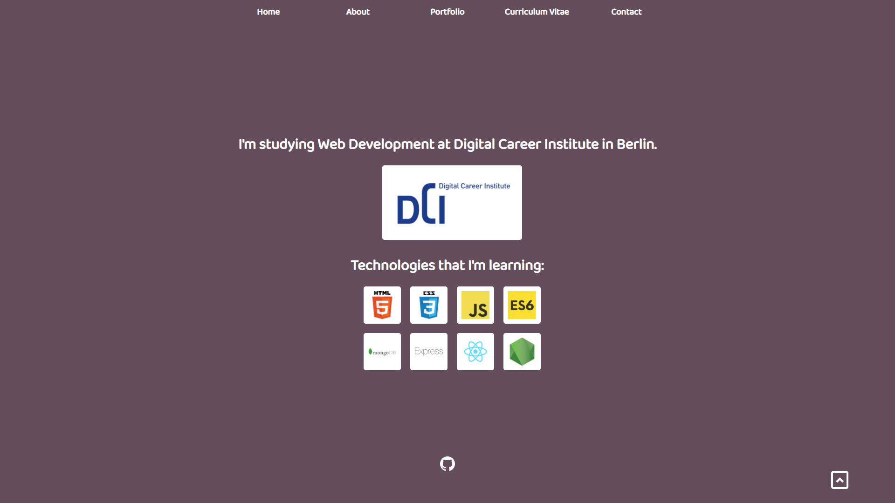

# My Portfolio

Hi, I'm Marcelo Soares Peralta.  
I'm a Web Developer.  

## **About**

I study web development at [DCI](https://digitalcareerinstitute.org/) in Berlin.

### Skills

- HTML  
- CSS  
- JavaScript  
- MongoDB  
- Express  
- React  
- Node.js  

## **Contact**

- Email:  
marcelosperalta@gmail.com

- LinkedIn:  
https://www.linkedin.com/in/marcelosoaresperalta/

### **Logo Reference**

- [GitHub](https://github.com/logos)

### **Layout Reference**

- [Caitlyn Greffly](https://caitlyngreffly.com/)

- [Matthew Williams](http://findmatthew.com)

### **Code Reference**

- [MDN](https://developer.mozilla.org/en-US/)

- [CSS-TRICKS](https://css-tricks.com/quick-css-trick-how-to-center-an-object-exactly-in-the-center/)

- [nekoCalc](https://nekocalc.com/px-to-rem-converter)

- [Hover.css](http://ianlunn.github.io/Hover/)

- [Visme](https://visme.co/blog/website-color-schemes/)

### **Guidelines**

- [How to disable text selection highlighting](https://stackoverflow.com/questions/826782/how-to-disable-text-selection-highlighting)  

- [Tutorial: Navegação One Page com efeito Scroll (sem javascript)](https://www.youtube.com/watch?v=QiI6PbD6Ei4)  

- [Ícone do site na aba do browser](http://henriquecorrea.com/news/Icone_do_site_na_aba_do_browser)  

- [Efeito de Máquina de Escrever com JavaScript](https://www.youtube.com/watch?v=zx2axQoY_YM)  

### **Tools**

- [Visual Studio Code](https://code.visualstudio.com/)

- [MATERIAL DESIGN](https://material.io/)

- [Google Fonts](https://fonts.google.com/)

- [Canva](https://www.canva.com/)

- [favicon.cc](https://www.favicon.cc/)

- [Formspree](https://formspree.io/)

### **Screeshots**

  

  

  

  